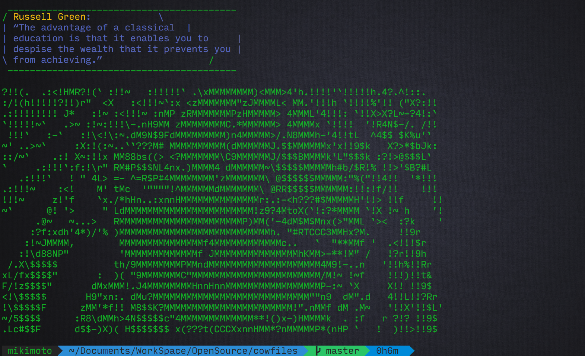

##cowfiles

Additional ASCII cowfiles for [cowsay](http://en.wikipedia.org/wiki/Cowsay)

###installation
First, download and install cowsay

- OSX using Homebrew
```brew install cowsay```

Next, you need to place the cowfiles somewhere that cowsay can locate them. I recommend creating a .cowsay folder under your home directory. Clone the contents of this repo in that folder

```
mkdir $HOME/.cowsay
git clone https://github.com/Mikimoto/cowfiles.git $HOME/.cowsay
```

Now, add the new folder to your $COWPATH environment variable. Append this line to your shell's configuration file (.bashrc, .zshrc, .cshrc).

*Plese note, if your $COWPATH default is null, remove it form your setting.*

``` bash
COWPATH="$COWPATH:$HOME/.cowsay"
```
or

``` bash
COWPATH="$HOME/.cowsay"
```

####cowsayquote

If you have [QOTD](https://en.wikipedia.org/wiki/QOTD) installed, here is a simple bash function that you can place in your shell's appropriate dotfile (bashrc, zshrc, cshrc) that will give you a useful quip from a funky cow.

Or you can use [fortune](http://en.wikipedia.org/wiki/Fortune_(Unix)) for test.

``` bash
# Cow-spoken fortunes every time you open a terminal
function cowsayquote {
  NUMOFCOWS=`cowsay -l | tail -n +2 | wc -w`
  WHICHCOW=$((RANDOM%$NUMOFCOWS+1))
  THISCOW=`cowsay -l | tail -n +2 | sed -e 's/\ /\'$'\n/g' | sed $WHICHCOW'q;d'`

   #echo "Selected cow: ${THISCOW}, from ${WHICHCOW}"
   quote | cowsay -f $THISCOW -W 100
}

cowsayquote
```

####screenshot

